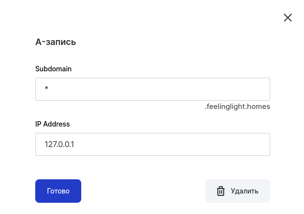

# Конфигурация

Основная конфигурация находится в **services/traefik/config/traefik.yaml**. Она считывается
только в момент запуска traefik.

Конфигурация сервисов находится в папке **services/traefik/config/services/**. Она
перезагружается traefik при изменении содержимого папки.

1 файл в папке сервисов = 1 сервис.

## Сертификаты Let's Encrypt

SSL сертификаты выписываются по 2 причинам:

- Чтобы в локальной сети не было не зашифрованного трафика
- Чтобы браузеры не ругались на незащищенное подключение

Сертификаты выписываются автоматически с помощью фичи ``certificatesResolvers`` traefik.

Traefik для работы с let's encrypt использует библиотеку [lego](https://go-acme.github.io/lego/).

Lego умеет работать с большим количеством DNS провайдеров, для реализации
[DNS-01 challenge](https://letsencrypt.org/ru/docs/challenge-types/#проверка-dns-01).

На данный момент используется провайдер [reg.ru](https://go-acme.github.io/lego/dns/regru/).

В настройках traefik задержка на подтверждение DNS challenge стоит 15 минут (900 секунд),
потому что у reg.ru есть [какие-то проблемы](https://github.com/traefik/traefik/issues/8165)
с подтверждением.

### Как настроить новый сертификат

- На [reg.ru](https://www.reg.ru/) должен быть аккаунт. Логин и пароль аккаунта указываются
  в переменных окружения ``REGRU_USERNAME`` и ``REGRU_PASSWORD``, в файле **.env**.
- Под этим аккаунтом нужно купить доменное имя.
- Для купленного домена нужно установить A-запись для всех поддоменов купленного домена. IP-адрес
  не важен

  

- В настройках аккаунта -> [Настройки API](https://www.reg.ru/user/account/#/settings/api/)
  нужно добавить IP-адрес, с которого будут выполняться API-запросы к reg.ru (белый IP
  маршутизатора).

  Если нет постоянного белого IP, то лучше указать подсеть 16 для текущего белого IP.

  Узнать текущий белый IP маршутизатора можно с помощью различных **whoami** сервисов,
  типа [такого](https://www.hashemian.com/whoami/)

- После выполненных выше шагов и запуска traefik, traefik выполнит запрос к reg.ru, и создаст
  TXT записи.

  Если все выполнено правильно, то рядом с A-записью в доменах reg.ru должны появиться TXT-записи.

- В течение следующих 15 минут все сервисы traefik будут доступны c сертификатом
  **TRAEFIK DEFAULT CERT**. Браузер не будет ему доверять, и будет выдавать предупреждение
  о недоверенном сертификате.

- Через 15 минут traefik завершит DNS challenge, TXT записи удалятся, а в папке
  **./services/traefik/data/acme** появится файл **acme.json** с сертификатами для всех
  доменов, присутствующих в конфигурации traefik.

При возникновении проблем смотреть логи traefik в **./services/traefik/logs/traefik.log** в
DEBUG режиме.

## Middlewares

Все middleware объявляются в **services/traefik/config/services/middlewares.yaml**. Если
объявлять их в **services/traefik/config/traefik.yaml**, то traefik их не увидит!

Текущие middleware:

- authelia (авторизация forwardAuth)

